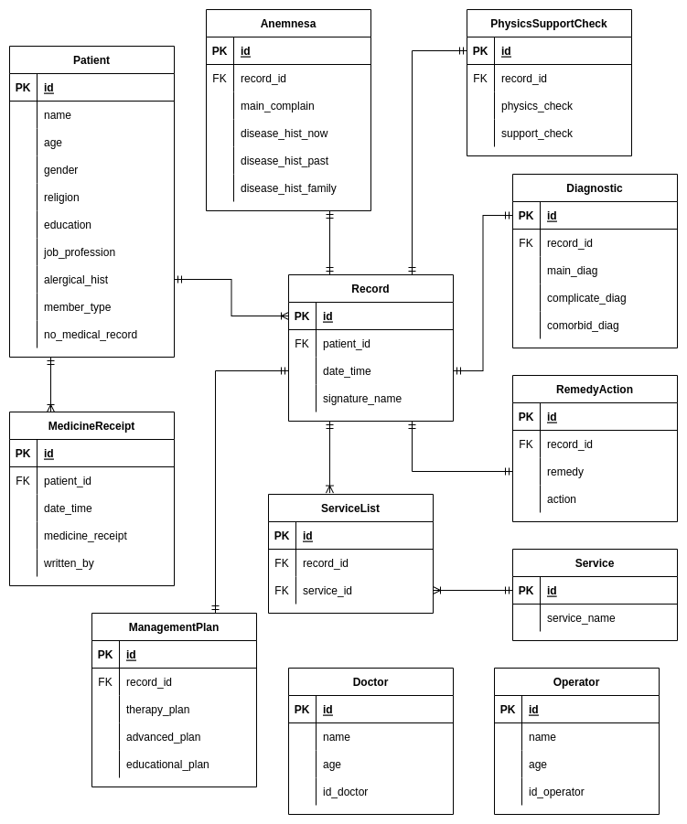

# E-Medical Record API Services
Medical Record is a basis for recording and managing patient historical data for decision making on actions and treatment for patients. The recording basis in question can be physical or electronic, which is currently known as E-MR (Electronic Medical Records). This E-MR API Services project provides an API Endpoint that has the basic functions of recording the Medical Records with flows such as physical recording.

One of the advantages offered in this electronic recording is that it can reduce the cost of maintaining medical records and the patient database. The lifetime of recording data in electronic is also longer than physical recording.

# Entity Relationship Diagram

The picture above is the ERD. The Record entity is the center of the ERD. It contains patient id, date and time the record is made and also the signature name in the record. From there it connects to other entities.

# How To Run

We can run these code below in shell first

```
$ git clone https://github.com/alif338/backend_EMR.git
$ cd backend_EMR
$ bundle install
$ rails db:migrate && rails db:seed
$ rails server
$ # Listening on http://127.0.0.1:3000
```

And then, we can use this Postman documentation to run or test APIs
https://www.getpostman.com/collections/96bcc238a3e4d6b0cdbd

Note: Use local url to replace `{{baseurl}}` when testing the API below 

## Operator
API used by Operator of the health care to show data and records. Can also be used to register new patients.

### (POST) Register New Patient
`{{base_url}}/api/v1/patients`

API used to register new patient into the database. Data included are name, age, gender, religion, education, job profession, allergical history, member type and medical record of the patient.

```json
{
  "patient" : {
      "name": "Ms. Jennie Schaden",
      "age": "1",
      "gender": "NaN",
      "religion": "NaN",
      "education": "voluptas",
      "job_profession": "International Security Technician",
      "alergical_hist": "reprehenderit",
      "member_type": "BPJS",
      "no_medical_record": "1.9.3"
    }
}
```

### (GET) Show All Patients
`{{base_url}}/api/v1/patients`

API used to show all patients data in the health care

### (GET) Show All Nurses
`{{base_url}}/api/v1/nurses`

API used to show all nurses data in the health care.

### (GET) Show Patient by id/Check In
`{{base_url}}/api/v1/patients/1`

API used to show patient data based on their id

### (GET) Get All Medical Records 
`{{base_url}}/api/v1/records`

API used to Get all of the medical record in the health care

## Nurse / Doctor Role
API used by Nurse and Doctor of the health care to help them record things to database

### (POST) Create New Record
`{{base_url}}/api/v1/nurses/record`

API used to record new appointment that contains the patient id, doctor id and the date time of when the appointment is made.

```json
{
  "patient_id": 1,
  "doctor_id": 1,
  "date_time": "Sun Apr 16 2023 12:20:52 GMT+0700 (Western Indonesia Time)"
}
```

### (POST) Write Anemnesa
`{{base_url}}/api/v1/nurses/anemnesa`

API used to record anemnesa of the patient that contains record id, main complaint, disease history now, disease history in the past and also family's disease history of the patient.

```json
{
  "record_id": 2,
  "main_complaint": "Itaque et eveniet modi quisquam.",
  "disease_hist_now": "Nesciunt consequatur porro voluptatem quos doloribus.",
  "disease_hist_past": "Consequatur et repellendus quia in.",
  "disease_hist_family": "Cupiditate quod modi vero soluta officiis itaque dolorum quas eveniet."
}
```

### (POST) Write Physics Support Check
`{{base_url}}/api/v1/nurses/physics_support_check`

API used to record the patient's physics data and supporting data that could help the doctor or nurse in finding solution of the patient's need. Record id is also recorded here.

```json
{
  "record_id": 2,
  "physics_check": "Id aut odit fugit repellat impedit quae nihil atque deleniti.",
  "support_check": "Amet dolorem omnis doloribus nemo laborum optio at."
}
```

### (POST) Write Diagnostic
`{{base_url}}/api/v1/nurses/diagnostic`

API used to write the main diagnosis, complicated diagnosis and the comorbid diagnosis of the patient.

```json
{
  "record_id": 2,
  "main_diag": "Accusantium et expedita.",
  "complicate_diag": "Deleniti quia aliquid necessitatibus.",
  "comorbid_diag": "Qui et optio occaecati expedita."
}
```

### (POST) Write Management Plan
`{{base_url}}/api/v1/nurses/management_plan`

API used to record on doctor and nurses's action to help the patient. Plan of how to do the therapy, advanced plan and education that would be given to the patient in order to help the recovery process is recorded using this API.

```json
{
  "record_id": 2,
  "therapy_plan": "Ullam fuga ipsum.",
  "advanced_plan": "Aut eligendi qui incidunt alias voluptas et culpa dolores.",
  "educational_plan": "Voluptate et eos sed aut quis temporibus ipsam voluptates."
}
```

### (POST) Write Remedy Action
`{{base_url}}/api/v1/nurses/remedy_action`

API used to record the remedy for the patient's disease. It will also record the action on how many times tha patient should take those remedies.

```json
{
  "record_id": 2,
  "remedy": "Non beatae magnam libero minus.",
  "action": "Tempore consequatur id ea sunt quam molestiae ipsa sunt cum."
}
```

### (POST) Write Medicine Receipt
`{{base_url}}/api/v1/nurses/medicine_receipt`

API used to record the date the medicine receipt is made. It will also record the medicine receipt the doctor or nurse decided followed by who wrote that medicine receipt.

```json
{
  "date_time": "Tue May 02 2023 01:18:46 GMT+0700 (Western Indonesia Time)",
  "patient_id": 1,
  "medicine_receipt": "quaerat",
  "written_by": "NaN"
}
```

## Our teams
- Efifah Nur Safitri (KM_G2BE1109)
- Rio Johanes Sumolang (KM_G2BE1129)
- Muhammad Alif Darmamulia (KM_G2BE2042)
- Syamsiyatuz Zahroatul Khoirotul Umath (KM_G2BE3011)
- Evandio Martin Batti (P_G2BE2064)
# Rails on Replit

This is a template to get you started with Rails on Replit. It's ready to go so you can just hit run and start coding!

This template was generated using `rails new` (after you install the `rails` gem from the packager sidebar) so you can always do that if you prefer to set it up from scratch. The only had two make config changes we had to make to run it on Replit:

- bind the app on `0.0.0.0` instead of `localhost` (see `.replit`)
- allow `*.repl.co` hosts (see `config/environments/development.rb`)
- allow the app to be iframed on `replit.com` (see `config/application.rb`)

## Running the app

Simple hit run! You can edit the run command from the `.replit` file.

## Running commands

Start every command with `bundle exec` so that it runs in the context of the installed gems environment. The console pane will give you output from the server but you can run arbitrary command from the shell without stopping the server.

## Database

SQLite would work in development but we don't recommend running it in production. Instead look into using the built-in [Replit database](http://docs.replit.com/misc/database). Otherwise you are welcome to connect databases from your favorite provider. 

## Help

If you need help you might be able to find an answer on our [docs](https://docs.replit.com) page. Feel free to report bugs and give us feedback [here](https://replit.com/support).